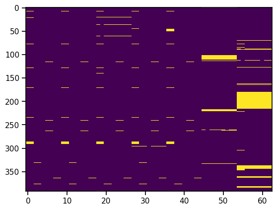

+++
title = "Sciencing Data: Values Missing Not At Random"
date = "2025-01-13 18:40:00"

[taxonomies]
tags=["data science", "projects"]

[extra]
repo_view = true
comment = false
+++

# Sciencing Data: Values Missing Not At Random

So one dataset [I explored](exploring_open_datasets.md) uses various soil and water measures
to predict nitrogen concentration in a lake during base flow and after storm events.

The dataset is interesting since it has a lot of features, relatively few rows and 
lots of missing values. Since I just read the fantastic [Chen at al. 2023](https://proceedings.mlr.press/v209/chen23a/chen23a.pdf)
paper on missing value analysis using explainable boosting machines, I felt
motivated to dive in to some missing value analysis.

I usually prefer a "depth-first" approach: As quickly as possible, go through rough data 
cleaning and processing to get a model working and then fill in where needed.
 In this case, I would have done well at least looking a bit closer at what values are missing
before jumping into imputation.

Here's a quick trick to see if there is a pattern to missing values: just plot the array
missing/not missing with `plt.imshow`. 

Beyond looking pretty it's also immediately clear there's a system to values missing.
Now this is related to sites and time and measurements, but let's not get into
that here. By staring at the image, or counting missings per row, we also
find out that a good bunch of rows have very many or all values missing, so 
if we throw those rows away we get this picture:

Much less scary, but still immediately clear that values are not missing at random.
Something we can use in modeling.

Notebook for this is [here](https://github.com/jrings/model_citizen/blob/main/notebooks/stream_nitrogen/missing_values.ipynb)